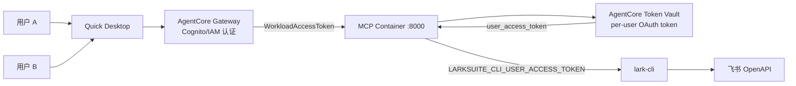
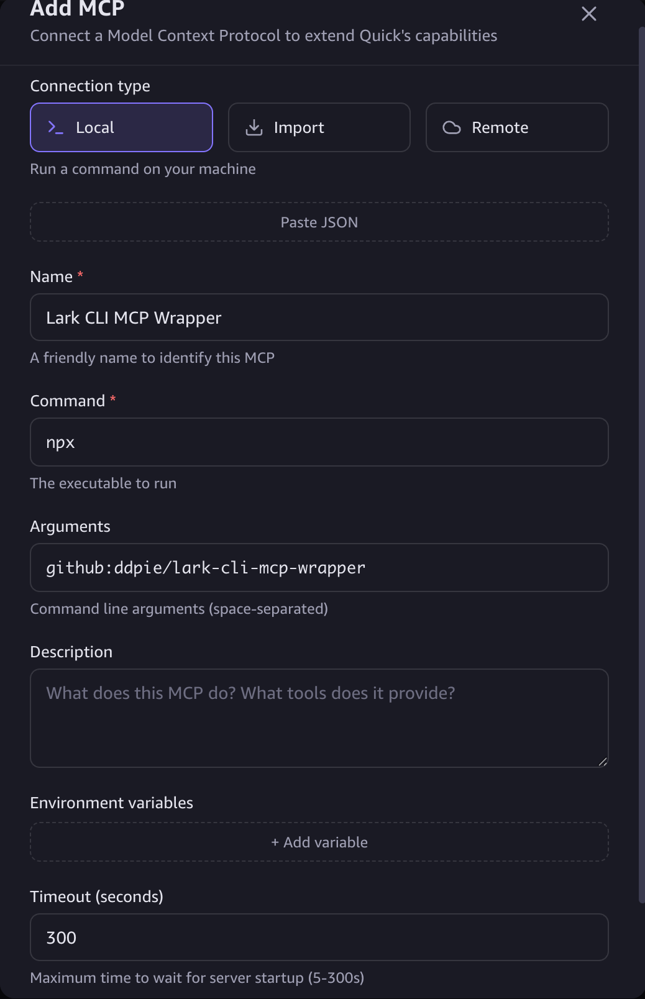
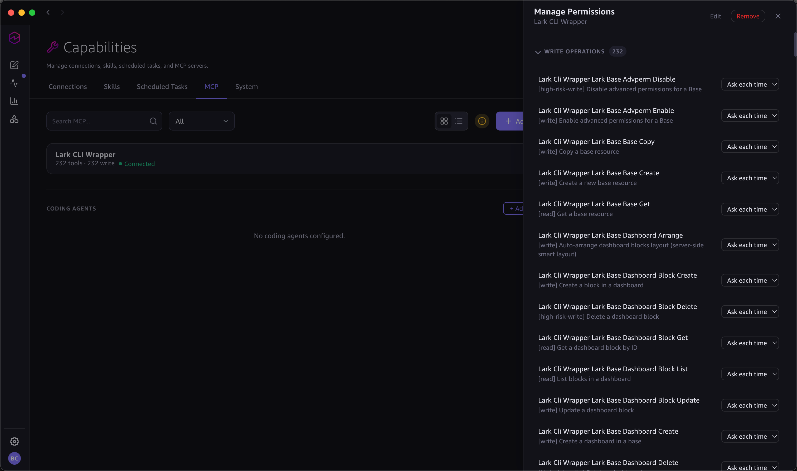

# lark-cli-mcp-wrapper

将 [lark-cli](https://github.com/larksuite/cli) 的 200+ 个命令封装为 [MCP](https://modelcontextprotocol.io/) server，让 [Amazon Quick Desktop](https://aws.amazon.com/quick/desktop/) 等 AI 助手直接操作飞书/Lark。

支持两种连接方式：
- **Remote MCP（AgentCore）** — 集中部署，用户无需本地安装
- **Local MCP** — 每台机器单独运行，无需服务器

## 功能

- 发送飞书消息、管理群聊
- 创建和查询日程、预订会议室
- 读写多维表格（Base）记录
- 操作云文档、知识库
- 管理审批、任务、邮件等
- 调用任意飞书 OpenAPI（2500+）

---

## 方式一：Remote MCP（AgentCore 部署）

集中部署到云端，用户无需安装 Node.js 或 lark-cli，通过 Quick Desktop Remote MCP 连接即可使用。

### 架构



**流程说明：**
1. 飞书管理员创建一个应用（App ID + Secret），所有用户共享
2. 每个用户首次使用时通过 OAuth 弹窗授权自己的飞书账号
3. Token Vault 自动缓存和刷新 per-user token
4. 每次工具调用以该用户的飞书身份执行

### 部署

```bash
cd deploy
bash deploy.sh
```

脚本会交互式提示输入飞书 App ID / Secret（也可通过环境变量 `LARK_APP_ID` / `LARK_APP_SECRET` 预设），然后自动：
- 构建 Docker 镜像并推送到 ECR
- 创建 Secrets Manager 密钥
- 注册飞书 OAuth Provider

> 脚本完成后会输出 `agentcore configure` 和 `agentcore launch` 命令，需手动执行完成最终部署。

详见 [deploy/](deploy/) 和 [infra/](infra/)（CDK 基础设施）。

### Quick Desktop 配置（Remote）

Settings → Capabilities → MCP → **+ Add MCP**：

| 字段 | 值 |
|---|---|
| Connection type | Remote |
| Name | Lark CLI MCP Wrapper |
| URL | AgentCore 部署后提供的 endpoint |

### 容器运行时环境变量

| 变量 | 说明 |
|---|---|
| `MCP_TRANSPORT` | `http` |
| `PORT` | HTTP 端口，默认 8000 |
| `LARKSUITE_CLI_APP_ID` | 飞书应用 App ID（容器内 lark-cli 使用） |
| `LARKSUITE_CLI_APP_SECRET` | 飞书应用 App Secret（容器内 lark-cli 使用） |
| `OAUTH_PROVIDER_NAME` | AgentCore OAuth provider 名称，默认 `feishu-oauth-provider` |
| `BIND_ADDRESS` | 绑定地址，默认 `0.0.0.0` |

---

## 方式二：Local MCP（个人使用）

每台机器本地运行，无需云服务器，通过 Quick Desktop Local MCP 连接。

### 前置条件

- [Node.js](https://nodejs.org/) >= 18、[Git](https://git-scm.com/downloads)
- [`lark-cli`](https://github.com/larksuite/cli) 已安装并完成 `auth login`（详见 [lark-cli README](https://github.com/larksuite/cli#readme)）

### Quick Desktop 配置（Local）

Settings → Capabilities → MCP → **+ Add MCP**：

| 字段 | 值 |
|---|---|
| Connection type | Local |
| Name | Lark CLI MCP Wrapper |
| Command | `npx` |
| Arguments | `github:ddpie/lark-cli-mcp-wrapper` |
| Timeout | `300` |

> 首次运行 npx 会从 GitHub 拉取并构建，耗时约 1-2 分钟。后续运行使用缓存，启动更快。



连接成功后显示为 **Connected**：



---

## 从源码构建

```bash
git clone https://github.com/ddpie/lark-cli-mcp-wrapper.git
cd lark-cli-mcp-wrapper
npm install
npm run generate-tools
npm run build
```

### 更新工具列表

```bash
npm run generate-tools && npm run build
```

### 运行测试

```bash
npm test
```

## License

MIT
