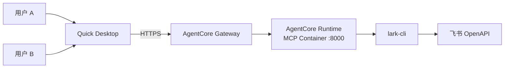

# lark-cli-mcp-wrapper

将 [lark-cli](https://github.com/larksuite/cli) 的 200+ 个命令封装为 [MCP](https://modelcontextprotocol.io/) server，让 [Amazon Quick Desktop](https://aws.amazon.com/quick/desktop/) 等 AI 助手直接操作飞书/Lark。

支持两种连接方式：
- **Remote MCP（AgentCore）** — 集中部署，用户无需本地安装，28 个精选工具 + raw API 兜底
- **Local MCP** — 每台机器单独运行，232 个全量工具

## 功能

- 发送飞书消息、管理群聊
- 创建和查询日程、预订会议室
- 读写多维表格（Base）记录
- 操作云文档、知识库
- 管理任务
- 调用任意飞书 OpenAPI（2500+，通过 `lark_raw_api`）

---

## 方式一：Remote MCP（AgentCore 部署）

集中部署到云端，用户无需安装 Node.js 或 lark-cli，通过 Quick Desktop Remote MCP 连接即可使用。

### 架构



### 部署

```bash
bash deploy/deploy.sh
```

脚本会交互式提示输入飞书 App ID / Secret（也可通过环境变量预设），然后自动完成：
- ECR 镜像构建推送
- Secrets Manager 密钥
- IAM 角色
- AgentCore Runtime（protocolConfiguration=MCP）
- AgentCore Gateway + Target

部署完成后输出 Gateway URL。

### Quick Desktop 配置（Remote）

Settings → Capabilities → MCP → **+ Add MCP**：

| 字段 | 值 |
|---|---|
| Connection type | Remote |
| Name | Lark CLI MCP Wrapper |
| URL | `deploy.sh` 输出的 Gateway URL |

### 工具说明

Remote 模式暴露 28 个精选工具（Gateway 限制 30 个/页）：

| 类别 | 工具 |
|---|---|
| IM | 发消息、搜索消息、群列表、聊天记录、搜索群 |
| Calendar | 日程概览、创建日程、查忙闲、找会议室 |
| Docs | 创建、获取、搜索、编辑文档 |
| Base | 获取表、查询数据、批量创建记录、搜索记录 |
| Drive | 搜索、上传、下载文件 |
| Task | 创建任务、我的任务、完成任务 |
| Contact | 搜索用户、获取用户信息 |
| Sheets | 读取、写入单元格 |
| **Raw API** | **调用任意飞书 OpenAPI（2500+），覆盖所有未列出的功能** |

### 环境变量

| 变量 | 说明 |
|---|---|
| `MCP_TRANSPORT` | `http` |
| `PORT` | 默认 8000 |
| `TOOL_MODE` | `gateway`（精选 28 工具）或不设（全量 232） |
| `LARKSUITE_CLI_APP_ID` | 飞书应用 App ID |
| `LARKSUITE_CLI_APP_SECRET` | 飞书应用 App Secret |

---

## 方式二：Local MCP

每台机器本地运行，无需云服务器，通过 Quick Desktop Local MCP 连接。暴露全部 232 个工具。

### 前置条件

- [Node.js](https://nodejs.org/) >= 18、[Git](https://git-scm.com/downloads)
- [`lark-cli`](https://github.com/larksuite/cli) 已安装并完成 `auth login`（详见 [lark-cli README](https://github.com/larksuite/cli#readme)）

### Quick Desktop 配置（Local）

Settings → Capabilities → MCP → **+ Add MCP**：

| 字段 | 值 |
|---|---|
| Connection type | Local |
| Name | Lark CLI MCP Wrapper |
| Command | `npx` |
| Arguments | `github:ddpie/lark-cli-mcp-wrapper` |
| Timeout | `300` |

> 首次运行 npx 会从 GitHub 拉取并构建，耗时约 1-2 分钟。后续使用缓存。


连接成功后显示为 **Connected**：


---

## 从源码构建

```bash
git clone https://github.com/ddpie/lark-cli-mcp-wrapper.git
cd lark-cli-mcp-wrapper
npm install
npm run generate-tools
npm run build
```

### 更新工具列表

```bash
npm run generate-tools && npm run build
```

### 运行测试

```bash
npm test
```

## License

MIT
